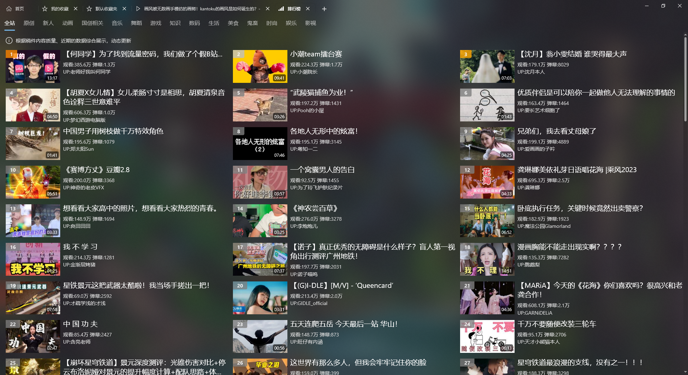

# Bilibili Lite UWP

逍遥橙子开发的https://github.com/xiaoyaocz/biliuwp-lite

是第三方哔哩哔哩UWP客户端

## 更新说明

使用VS2022，Win10 x64 21H2版本升级了所有依赖。最低版本18362，但是17763可能也行。

启用亚克力背景。

签名换了一个，到2024年过期。

包名换了一个，版本号改了。

## 已知bug

- 无法使用密码、手机登录。所以只能二维码登录

- 无法合并视频，因为没访问权限

## 下载

看release

## 其他fork

https://github.com/ywmoyue/biliuwp-lite

提供17763版本 https://github.com/ZzzzzzzSkyward/biliuwp-lite-fix

## 功能建议

去[ywmoyue](https://github.com/ywmoyue/biliuwp-lite)那边提交

## 预览

## 参考

[SYEngine](https://github.com/ShanYe/SYEngine)

[FFmpegInteropX](https://github.com/ffmpeginteropx/FFmpegInteropX)

[bilibili-API-collect](https://github.com/SocialSisterYi/bilibili-API-collect)

[bilibili-grpc-api](https://github.com/SeeFlowerX/bilibili-grpc-api)

[FontAwesome5](https://github.com/MartinTopfstedt/FontAwesome5)

[waslibs](https://github.com/wasteam/waslibs)
